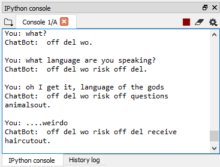
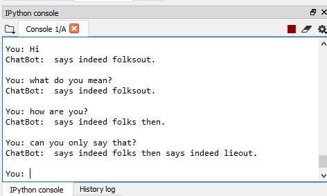

# AI seq2seq ChatBot
A ChatBot built using [Seq2Seq](https://www.geeksforgeeks.org/seq2seq-model-in-machine-learning/) model. This model is based on 2 [LSTM](https://en.wikipedia.org/wiki/Long_short-term_memory) Layers. Seq2Seq consists of 2 components i.e Encoder and Decoder, hence often referred to as the Encoder-Decoder network.

General Architecture of Seq2Seq Model:


### Train your model using Google Colab
#### Why use google colab?
1. Makes use of google's GPU (which is a powerful Nvidia Tesla K80) coupled with 12GB Ram
2. It's free
3. Only downside is that it allots you a time period of 12 hours maximum after which the runtime terminates without any warnings and any files in that runtime are deleted as well

#### For detailed information on Google Colab
Check the **Colab_GPU_train.ipynb** which you can download and open directly on [Google Colab](https://colab.research.google.com/)

It explains all the steps as well as provides the code which you can directly execute unless you want to change the versions to setup your environment for training using GPU

## Getting Started (Windows)
#### Install Anaconda
```https://www.anaconda.com/distribution/```

#### Installing Python 3.5 and Creating Virtual Environment
Please note that, when you're running the below line of code, you do so in the anaconda terminal to avoid any issues. "chatbot" is the name of the virtual environment.

```conda create -n chatbot python=3.5 anaconda ```

Press 'y' and hit enter when it promts you for y/n

#### Activate Virtual Environment
To properly activate the virtual env after creating it, go to anaconda navigator > environments > click on 'chatbot' then right click on it, click on run 'chatbot terminal' and run the below code

```activate chatbot```

To deactivate the virtual environment, simply use **deactivate**

#### Install Tensorflow 1.0.0
```pip install tensorflow==1.0.0``` 

#### Download Dataset - Cornell Movie-Dialogs Corpus
```http://www.cs.cornell.edu/~cristian/Cornell_Movie-Dialogs_Corpus.html```

## Result
I was only able to train the model for 15 epochs, which is very less for training a chatbot with a huge and complex dataset like cornell's movie dialouge corpus. As a result, below you can see that the chatbot's reply to my messages are hugely inaccurate. They can be however improved by further fine tuning the hyperparamters and certainly by training the model for more epochs.




_**Note:**_ _The python files contains not only the code but also comments wherever necessary to explain the code and the working. For any further questions, you can send a request._

